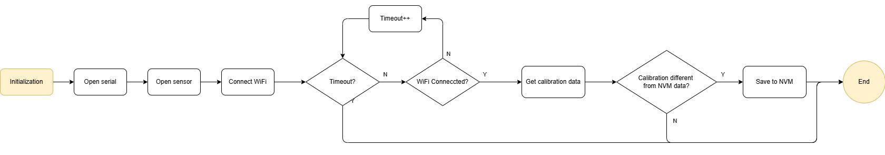

# NodeMCU-32S-Iot-Web

A complete IoT project using an ESP32 (NodeMCU-32S) development board to collect temperature and humidity data from a DHT22 temperature & humidity sensor and send it to a Flask-based web server. The data is stored in a SQLite database and visualized on a web dashboard using Chart.js.

---

## Architecture

[ESP32] --(via HTTP POST)--> [Flask API Server (Python)] --> [SQLite / CSV] --> [Web UI]

### ESP32 Flowchart
Overall process as below flowchart, including two processes: 1) Initialization. 2) Loop


Initialization process starts WiFI, DHT sensor and HTTP modules. Also, it will fetch calibration if available.


Loop process responsible for reading temperature and himidity data, then send the data to Flask server.


---
## Features

- ESP32-based data acquisition using DHT22 sensor
- Fetch sensor calibration data when system startup
- Send temperature and humidity data via HTTP POST to Flask server
- SQLite for simple and lightweight storage
- REST API endpoints for data access
- Chart.js front-end for real-time graph display

---

## Hardware Requirements

- NodeMCU-32S (ESP32 Dev Board)
- DHT22(or DHT11) sensor module
- Jumper wires
- Micro USB cable

---

## Software Requirements

- VSCode with PlatformIO IDE plugin(Version: 3.3.4)
- PlatformIO IDE library: DHT sensor library by Adafruit(Version: 1.4.6)
- Docker
---

## Project Structure

```
NodeMCU-32S-Iot-Web/
├── src/                  # Arduino code for ESP32 (PlatformIO compatible)
│   
├── Flask_Server/         # Web server
│   ├── app.py            # Server main program
│   ├── data.db           # Auto-generated by Flask framework
│   ├── templates/
│   │   └── index.html
│   └── static/
│       └── script.js
├── README.md
└── platformio.ini
```
---

## Getting Started

### ESP32 (PlatformIO)
1. Open `esp32` folder with PlatformIO.
2. Modify `WiFiCredential.c` with your WiFi credentials and server IP.
3. Upload code to NodeMCU-32S via USB.
4. Use Serial Monitor to verify transmission.

### Flask Server
## Using virtual environment
1. Open terminal or powershell
2. Create a virtual environment name "venv" `python -m venv venv`
3. Open the environment `.\venv\Scripts\activate`
4. Install flask dependency `pip install flask`
5. Run server `python app.py`
6. Use web browser to open server webpage to explore history data and upload sensor calibration data.

---

## API Endpoints
1. TBD

---

## Troubleshooting
### ESP32
1. Can't connect to ESP32 -> Check your UART port using "Device Manager" in Windows system
2. The temperature and/or humidity reading shows `Failed to read DHT` -> Sensor's jumper might not working
3. Led light on ESP32 EVB is not working -> Check voltage output
4. WiFi timeout -> ESP32 only supports 2.4Ghz WiFi. Some WiFi AP have issues with IoT devices(like Ubiquiti AP). Try to use laptop mobile hotspot.


### Webserver
1. Cannot connect to server -> Check IP address of the server and the IP address in `app.py`
2. ESP32 shows WiFi is connected, but no data shown on the web server -> Check your firewall

---

## To Be Done List:
### ESP-32
1. Seperate functions into libraries for better maintenance.
3. Use watchdog for system monitoring.
4. Add recover mechaism when Wi-Fi failure or power lost.
5. Sensor calibration mechanism.(ongoing)

### Flask
1. Dockerlized Flask server.

---

## License

MIT License. Feel free to use and modify this project for your personal or academic purposes.
